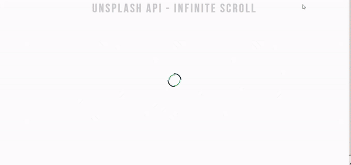

<h1 align="center">
    💻 JS- Practice Projects
</h1>

# Table of Contents

<!--ts-->

- [About](#About)
- [Projects](#projects)
  - [01 - Quote Generator](#quote-generator)
  - [02 - Infinite Scroll](#infinite-scroll)
  - [03 - Picture in Picture](#picture-in-picture)
  - [04 - Joke Generator](#joke-generator)
  - [05 - Theme Switcher](#theme-switcher)
  - [06 - Animation on Scroll](#animation-on-scroll)
  - [07 - Animated Navigation](#animated-navigation)
  - [08 - Music Player](#animated-navigation)

### About

This repo contains the projects created for the [JavaScript Web Projects](https://www.udemy.com/course/javascript-web-projects-to-build-your-portfolio-resume/)
course that i'm currently taking.

[Live demo](https://allangpio.github.io/JS-practice-projects/)

Those are projects to practice some JS application on the Front-End like.

#### 🚧 Under construction 🚧

This repo contains 7 of the 20 projects of the course.

---

### Quote Generator

#### Features

<ul>
    <li>Getting random quotes from the [Forismatic API](https://forismatic.com/en/)</li>
    <li>Button to share quote on Twitter</li>   
</ul>

 

### Infinite Scroll

#### Features

<ul>
    <li>Getting random photos from the [Unsplash API](https://unsplash.com/developers)</li>
    <li>Load more photos before the user reach the bottom of the website</li>   
</ul>

### Picture in Picture

#### Features

<ul>
    <li>Get media from the user</li>
    <li>Allow Picture-in-picture mode</li>   
</ul>

### Joke Generator

#### Features

<ul>
    <li>Get a random joke from the [JokeAPI](https://sv443.net/jokeapi/v2/)</li>
    <li>Pass the joke to the [VoiceRSS API](http://www.voicerss.org/) to generate a text to speech audio</li>
    <li>Play the audio from a random joke when user clicks the button</li>    
</ul>

### Theme Switcher

#### Features

- A theme switcher (Light/Dark mode) for a generic landing page

### Animation on Scroll

#### Features

- Animations on scroll on a generic landing page using the [AOS lib](https://michalsnik.github.io/aos/)

### Animated Navigation

#### Features

- An animated navigation menu

### Music Player

#### Features

- Navigate through track by clicking the progress bar
- Play, pause, previous and next song
- Cumtom styles for the player controls

### Autor

---

<b>Allan Gaia Pio</b>

Made by Allan Gaia Pio 👋🏽 Get in touch!

